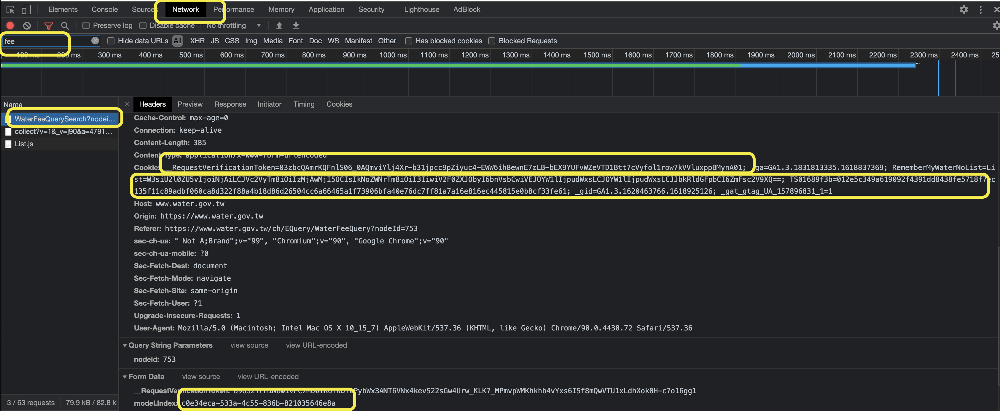

Home assistant support for TaiWater Fee

The method was provided by [Jason Lee](https://www.dcard.tw/@jas0n.1ee.com).

***User the integration by your own risk***

## Install

You can install component with [HACS](https://hacs.xyz/) custom repo: HACS > Integrations > 3 dots (upper top corner) > Custom repositories > URL: `tsunglung/TaiWaterFee` > Category: Integration

Or manually copy `taiwater_fee` folder to `custom_components` folder in your config folder.

Then restart HA.

# Setup

You need to grab a cookie and three tokens.

**1. Basic steps for grabbing**

1. Open the development tools (use Google chrome/Microsoft Edge) [Crtl+Shift+I / F12]
2. Open the Network tab
3. Open the [TaiWater Fee Web site](https://www.water.gov.tw/ch/EQuery/WaterFeeQuery?nodeId=753), Enter the Water ID and input Verification code.
4. Search for "fee" (for me only three itemes shows up, choose the first one)
5. Go to "headers" -> "request headers"
6. copy the all characters in the field Cookie (mark with the mouse and copy to clipboard)
7. Go to "headers" -> "from data"
8. copy the 36 characters like "5e8e1218-59e1-42f0-bd5d-bde8be4ae30e" in the field "model.Index"  (mark with the mouse and copy to clipboard)
9. copy the 108 characters like "XXXXXXXXXXXXX....." in the field "\__RequestVerificationToken"  (mark with the mouse and copy to clipboard)
10. Copy the 5 characters in the field "VerificationCode" (mark with the mouse and copy to clipboard)

# Config

**2. Please use the config flow of Home Assistant**

1. With GUI. Configuration > Integration > Add Integration > TaiWater Fee
   1. If the integration didn't show up in the list please REFRESH the page
   2. If the integration is still not in the list, you need to clear the browser cache.
2. Enter Water ID without dash.
3. Paste the cookie and three tokens into the indicated field, all fields are Required.

# Notice
The cookie and tokens will expired after hours. If you saw the https_result is 403, you need get the new cookie and tokens again.
Then got to Configuration > Integration > TaiWater Fee > Options, enter the info of cookie and tokens.
